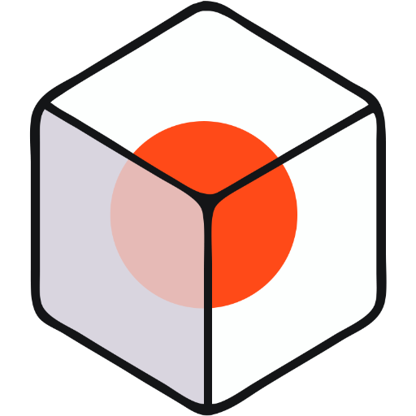
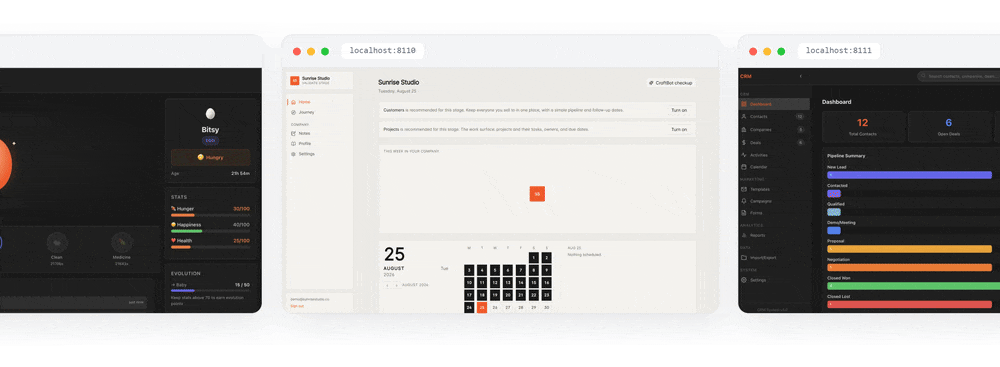
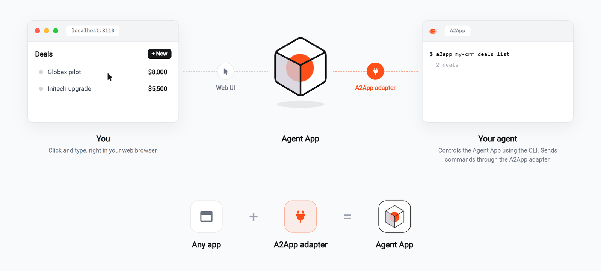
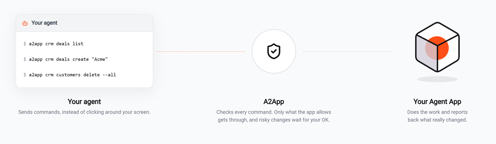
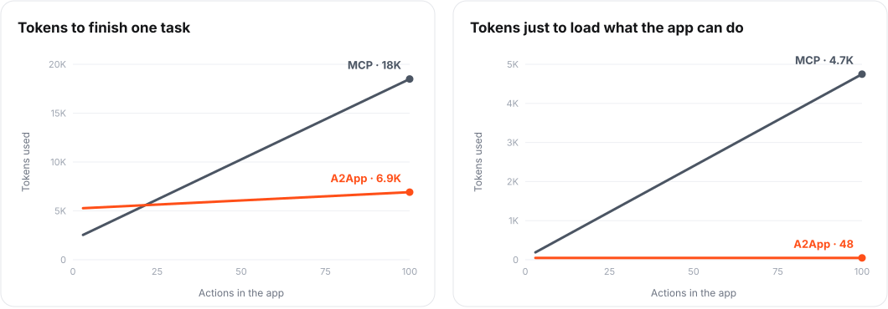

<div align="center">



# Agent App

**Agent App is the application that AI agents build, evolve, and operate. A collaboration space for humans and agents beyond chat, voice, and generative UI.**

[](https://www.npmjs.com/package/agent-app-framework)
[](LICENSE)
[](https://nodejs.org)
[](https://github.com/CraftOS-dev/Agent-App/stargazers)
[](CONTRIBUTING.md)

[📦 npm](https://www.npmjs.com/package/agent-app-framework) · [📖 Spec](spec/) · [🧩 Harness plugins](harness-plugins/) · [🤝 Contribute](CONTRIBUTING.md)



</div>

* * *

An **Agent App** is a complete, stateful application. It has its own frontend, backend, and database that humans use **visually** and agents use **programmatically** using CLI-walk. The agent is the developer, the operator, and the software vendor, while you own the code, the data, and the features.

<p align="center"></p>

An Agent App is **tech-stack-agnostic** (any stack works, given a matching A2App adapter) and **harness-agnostic** (every agent harness can use it through a plugin or skills). This repository makes it a standard:

- the **Agent App Framework**: provides tools for any agent harnesses to build their own Agent App
- the **A2App protocol**: bi-directional communication protocol between an agent and an agentic app
- the **A2App adapter**: connecting an Agent App to any tech stack

```
app + A2App adapter = Agent App
```

* * *

## 🚀 Get started

Three steps:

**1. Install the CLI.**

```bash
npm i -g agent-app-framework
```

This gives you and your AI agent two commands: **`agent-app`** (build, evolve, manage) and **`a2app`** (operate).

**2. Connect it to your harness.** Choose one of two routes. Both need the CLI from step 1.

*Skills (works with any harness).* Copy the framework skills into the folder where your harness loads `SKILL.md` skills:

```bash
agent-app skills --install <your-harness-skills-dir>   # e.g. .claude/skills
```

*Plugin (a deeper fit).* A plugin adds the skills plus commands, and in some harnesses a panel to see and manage your apps. For example:

**[OpenClaw](harness-plugins/openclaw/)**

```bash
openclaw plugins install @craftos/agent-app-openclaw
openclaw plugins enable a2app
```

Type `/agent-app build a CRM` in chat, or open the **Agent Apps** tab in the Control UI and click **New +**. To show your apps inside that tab, set `gateway.controlUi.embedSandbox: "trusted"` in your OpenClaw config (otherwise it wouldn't work).

**[Pi](harness-plugins/pi/)**

```bash
pi install npm:@craftos/agent-app-pi
```

Type `/agent-app build a CRM` in Pi.

**[deepseek-harness](harness-plugins/dsh/)**

```bash
dsh plugin --profile web add @craftos/agent-app-dsh
```

In the dsh web UI, click **Agent Apps** in the left sidebar and use **New +**, or ask the agent in chat to build an app.

For Claude Code, Hermes, CraftBot, and other harnesses, see [harness-plugins/](harness-plugins/).

**3. Describe what you want.** Tell your harness the app you need: a CRM, a dashboard, an expense tracker, anything. It refines the requirement, builds a full application to the Agent App Building Standard, verifies it, and launches it. Your need changes? Just tell the agent to evolve the agent app.

That's it! You now have custom software that both you and your agent can use.
**Happy collaboration!**

* * *

## 🛠️ Driving it with AI agent

Everything the harness does runs through two commands (You can drive the full loop by hand, but it is recommended to let your agent runs it).

**Operate — `a2app`** is a walk: you name a place in the app and act where you land.

```bash
a2app <app>                         # the app's modules (start here)
a2app <app> planning cards          # one entity: its fields and operations
a2app <app> planning cards <id>     # one record, and what its state allows now
a2app <app> data cards create --title "Buy milk" --due tomorrow
a2app <app> --find invoice          # search names, get locations
a2app <app> tasks next --wait 60000 # block until the app has work, claim it, print it
```

`<app>` is a directory, a registered id/name, or an `http(s)` URL (a URL operates a remote app, with its identity verified and pinned).

**Build & evolve — `agent-app`:**

```bash
agent-app <dir> scaffold            # framework files + ownership canon
agent-app <dir> validate            # the validation + security gate
agent-app <dir> serve               # launch via the manifest pipeline
agent-app <dir> dev / promote       # safe-evolve: build on a hidden port, gate, promote with backup
agent-app <dir> bridge start        # watch the app's task queue and trigger your harness
agent-app list                      # every app with its port and live status
```

* * *

## 🧩 A2App in the protocol stack

A2App is how your agent communicates with an Agent App. Agent Apps are built to include a CLI, which is the primary way an agent uses them. The agent then performs a CLI-walk to navigate and use the Agent App.

<p align="center"></p>

What is the difference between MCP, A2A, A2UI, and A2App? Each protocol has its own job, we listed the difference here:

| Protocol | What it does |
|---|---|
| [MCP](https://modelcontextprotocol.io) | Connects AI apps to outside tools and data |
| [A2A](https://a2a-protocol.org) | Lets AI agents talk to each other |
| [A2UI](https://a2ui.org) | Lets agents describe interfaces that apps render natively |
| **A2App** | **Lets agents control a large-scale app** |

* * *

## 📊 A2App vs MCP: token benchmark

Tokens are what an AI agent spends on every message. We compared the same task on the same app, once with MCP (one tool per action) and once with A2App.

<p align="center"></p>

- **Loading what the app can do.** MCP lists every action as a tool up front, so the list grows with the app: 4.7k tokens at 100 actions. A2App gives the agent one command of ~50 tokens, and the agent walks to what it needs.
- **Finishing one task.** For very small apps, MCP costs slightly less because it needs fewer steps. Past about ~20 actions, A2App pulls ahead: 7k tokens at 100 actions, against 18k for MCP.

<sub>Larger the app, better the token efficiency is for A2App</sub>

* * *

## 🔧 Build from source

```bash
pnpm install && pnpm -r build && pnpm -r test
```

The normative contracts are the JSON Schemas in [spec/](spec/); the [conformance/](conformance/) suite is how an implementation proves it conforms. To contribute, see [CONTRIBUTING.md](CONTRIBUTING.md).

* * *

## 📜 License

Yup. [MIT](LICENSE)
